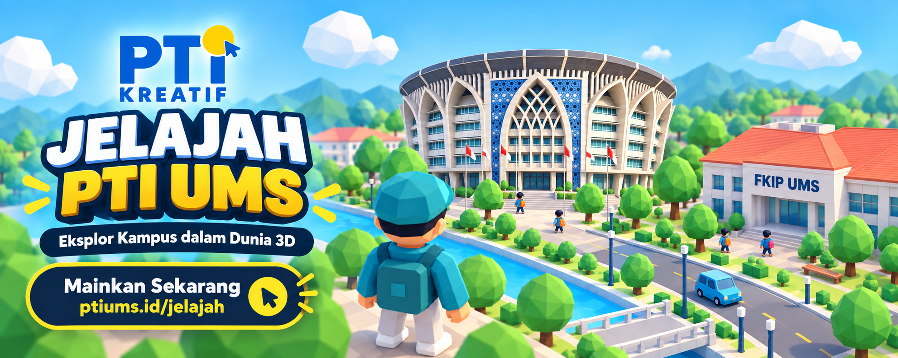
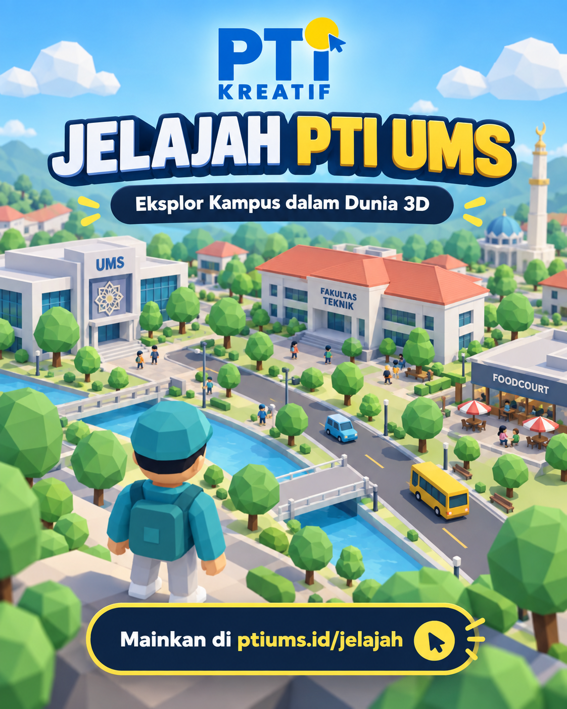
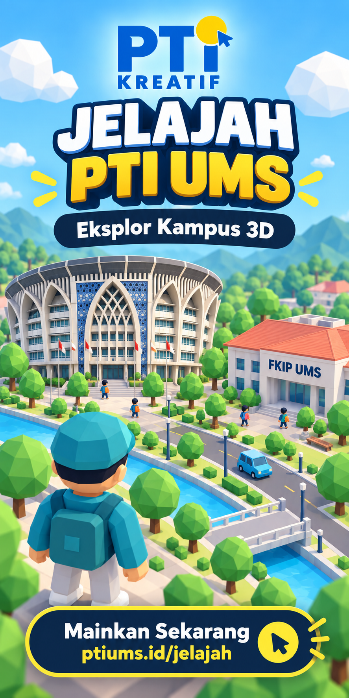

# Jelajah PTI-UMS

MVP website eksplorasi kampus 3D untuk promosi Program Studi Pendidikan Teknik Informatika Universitas Muhammadiyah Surakarta.



## Informasi Website

- Website: <https://ptiums.id/jelajah/>
- Repositori: <https://github.com/arifsetwn/jelajahptiyuk>
- Panduan kontribusi: [cara_kontribusi.md](./cara_kontribusi.md)


## Tech Stack

- **Framework**: React with Vite (TypeScript)
- **3D Engine**: Three.js via @react-three/fiber and @react-three/drei
- **Physics**: @react-three/rapier
- **State Management**: Zustand
- **Styling**: Tailwind CSS (via @tailwindcss/vite) and custom CSS
- **Testing**: Vitest & jsdom
- **Build Tool**: Vite


## Fitur

- Diorama kampus low-poly yang dibuat secara procedural tanpa Blender.
- Lima belas lokasi: lima ruang PTI/FKIP dan sepuluh landmark UMS.
- Karakter yang dapat dikendalikan dengan keyboard atau tombol arah sentuh.
- Kamera follow dan overview.
- Collision karakter dengan gedung.
- Penanda lokasi dan pop-up informasi.
- Peta skematik dan progres kunjungan.
- Penyimpanan progres serta preferensi di browser.
- Mode grafis ringan dan detail.
- Tampilan responsif untuk desktop dan mobile.
- Fallback HTML untuk perangkat tanpa WebGL.
- CTA akhir menuju website PTI UMS.

## Menjalankan proyek

Persyaratan: Node.js versi yang didukung oleh Vite dan npm.

```bash
npm install
npm run dev
```

Buka URL lokal yang ditampilkan Vite.

## Build produksi

```bash
npm run build
npm run preview
```

Hasil build tersedia di direktori `dist`.

## Pengujian

```bash
npm test
```

## Kontrol

- `WASD` atau tombol panah: berjalan.
- `E` atau `Space`: membuka informasi lokasi terdekat.
- `M`: membuka atau menutup peta.
- Tombol arah pada layar: kontrol mobile.

## Aset promosi

### Media sosial



### Sidebar blog



### Footer website


## Struktur utama

```text
src/
├── components/
│   ├── CampusBuildings.tsx
│   ├── CampusScene.tsx
│   ├── Interface.tsx
│   └── Player.tsx
├── data/
│   └── locations.ts
├── store/
│   └── useExperience.ts
├── App.tsx
├── styles.css
└── types.ts
```
