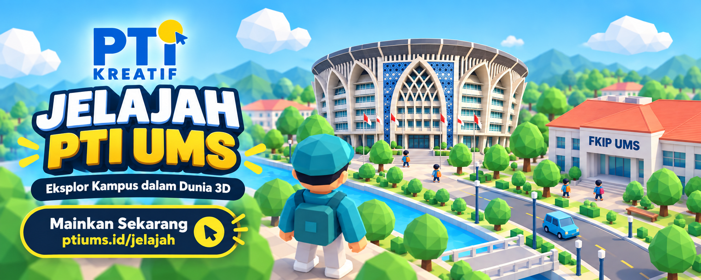
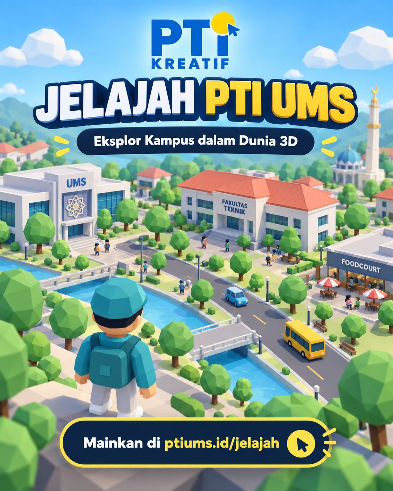
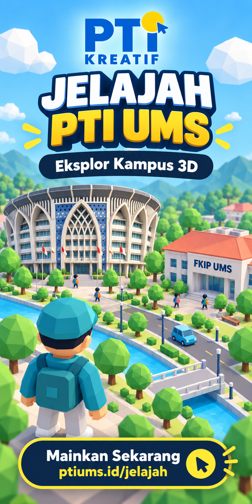

# Jelajah PTI-UMS

MVP website eksplorasi kampus 3D untuk promosi Program Studi Pendidikan Teknik Informatika Universitas Muhammadiyah Surakarta.



## Informasi Website

- Website: <https://ptiums.id/jelajah/>
- Repositori: <https://github.com/arifsetwn/jelajahptiyuk>
- Panduan kontribusi: [cara_kontribusi.md](./cara_kontribusi.md)


## Tech Stack

- **Framework**: React with Vite (TypeScript)
- **3D Engine**: Three.js via @react-three/fiber and @react-three/drei
- **Physics**: @react-three/rapier
- **State Management**: Zustand
- **Styling**: Tailwind CSS (via @tailwindcss/vite) and custom CSS
- **Testing**: Vitest & jsdom
- **Build Tool**: Vite


## Fitur

- Diorama kampus low-poly yang dibuat secara procedural tanpa Blender.
- Lima belas lokasi: lima ruang PTI/FKIP dan sepuluh landmark UMS.
- Karakter yang dapat dikendalikan dengan keyboard atau tombol arah sentuh.
- Kamera follow dan overview.
- Collision karakter dengan gedung.
- Penanda lokasi dan pop-up informasi.
- Peta skematik dan progres kunjungan.
- Mini game mancing, basket, dan mini soccer dengan rekor lokal.
- Penyimpanan progres serta preferensi di browser.
- Mode grafis ringan dan detail.
- Tampilan responsif untuk desktop dan mobile.
- Fallback HTML untuk perangkat tanpa WebGL.
- CTA akhir menuju website PTI UMS.

## Menjalankan proyek

Persyaratan: Node.js versi yang didukung oleh Vite dan npm.

```bash
npm install
npm run dev
```

Buka URL lokal yang ditampilkan Vite.

## Build produksi

```bash
npm run build
npm run preview
```

Hasil build tersedia di direktori `dist`.

## Pengujian

```bash
npm test
```

## Kontrol

- `WASD` atau tombol panah: berjalan.
- `E` atau `Space`: membuka informasi lokasi terdekat.
- `E` di tepi lapangan: mulai mini game basket atau mini soccer.
- `M`: membuka atau menutup peta.
- Tombol arah pada layar: kontrol mobile.

## Aset promosi

### Media sosial



### Sidebar blog



### Footer website


## Struktur utama

```text
src/
├── components/
│   ├── CampusBuildings.tsx
│   ├── CampusScene.tsx
│   ├── Interface.tsx
│   └── Player.tsx
├── data/
│   └── locations.ts
├── store/
│   └── useExperience.ts
├── App.tsx
├── styles.css
└── types.ts
```


## Mini game mancing

Dekati penanda **Spot mancing** di dermaga Kantin Tepi Danau. Tekan **E** atau tombol **Mancing**, lalu **Lempar umpan**. Setelah ikan menyambar, tekan **Space** atau **Tarik!** ketika garis berada dalam zona hijau. Ikan kemudian ditarik dari danau menuju pemancing; progress penarikan selesai sebelum hasil tangkapan ditampilkan. Tombol **Selesai** atau **Escape** mengembalikan karakter ke posisi sebelum mancing.

Koleksi berisi nila, mujair, lele, patin, dan gurame, dengan jumlah tangkapan dan rekor panjang. Data tersimpan lokal di browser (`jelajah-pti-fishing-v1`), terpisah dari progres kunjungan. Data tidak tersinkron antarperangkat. Jika penyimpanan browser tidak tersedia, koleksi hanya bertahan selama sesi. Ukuran ikan adalah atribut permainan.

Membuka peta/panduan mengakhiri sesi; berpindah tab membatalkan percobaan tanpa penalti. Suara sambaran dan hasil mengikuti tombol sound. Implementasi berada di `src/fishing/`; tidak memerlukan backend atau perubahan konfigurasi hosting `/jelajah/`.

## Mini game basket dan mini soccer

Dekati tepi lapangan basket atau mini soccer, lalu tekan **E** atau tombol **Main**. Setiap sesi berisi lima percobaan. Pada basket, tekan **Siap lempar** lalu **Space** atau **Lempar!** saat indikator berada di zona hijau. Pada mini soccer, pilih arah **Kiri**, **Tengah**, atau **Kanan**, tekan **Siap tendang**, lalu **Space** atau **Tendang!** pada zona hijau sambil memperhatikan gerak kiper. Pemain mobile memakai tombol yang sama di layar.

Basket memberi dua poin per bola masuk (maksimal 10), sedangkan mini soccer memberi satu poin per gol (maksimal 5). Medali dan rekor terbaik disimpan di browser dengan kunci `jelajah-pti-sports-v1`, terpisah dari progres kunjungan dan koleksi ikan. Jika penyimpanan gagal, hasil tetap tersedia selama sesi. **Escape** atau tombol tutup mengakhiri sesi; membuka peta/panduan juga mengembalikan kontrol karakter. Implementasi berada di `src/sports/` dan tidak memerlukan backend.
